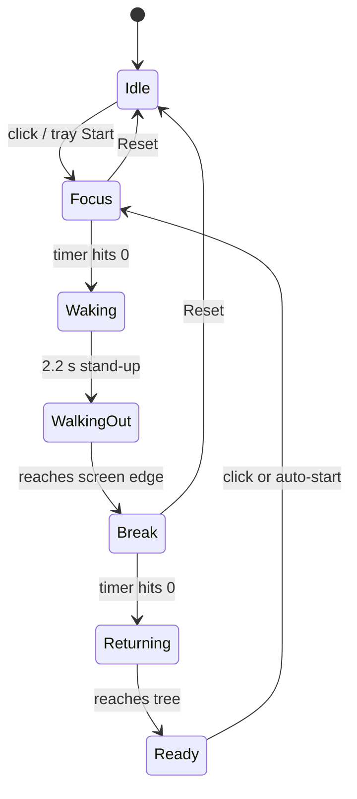
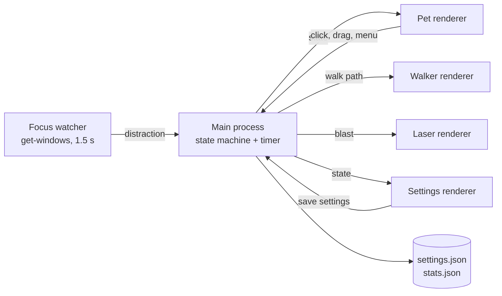

# Bodhi Pomodoro — Desktop Pet Handoff

2026-09-17 · Afsal Ali · Live version: https://claude.ai/code/artifact/ba4aee69-6489-4ff1-8e5c-38967b83ca33

## Summary

Build a Windows-first desktop pet where a soft-shaded vector Buddha meditates under a Bodhi tree for the focus session, wakes when it ends, and walks out across the screen for the break. v1 ships as a portable Electron app in about 4 weeks of part-time work; a working prototype already exists.

**Core loop**

1. Click the Buddha (or tray > Start). He closes his eyes, an aura ring fills as time passes, leaves drift down.
2. Timer ends: a bell rings, he stands up, steps off the cushion and walks to the edge of the chosen monitor.
3. Break runs with an empty cushion under the tree and a countdown.
4. Break ends: he walks back, sits, and waits for a click (or auto-starts if enabled). Every 4th break is a long walk.

**v1 scope (must have)**

- Presets 25/5, 15/3, 50/10, 90/20 plus custom minutes for focus, short break, long break, cycles.
- Pick which monitor he lives on; dragging him to another monitor also selects it.
- Always-on-top transparent window, drag to move, right-click menu, tray icon with live countdown.
- Soft-shaded vector character from the reference: pale skin, orange robe, topknot, shades, both hands drawn normally.
- Settings and position persist between launches.

**Not in v1:** task lists, stats dashboards, cloud sync, multiple pets, mobile.

## Prior art

Nobody ships a meditation-themed pet where the break is the pet leaving the screen, so the concept is open. The mechanics (transparent overlay, drag, tray, sprite animation) are solved problems; borrow them, don't reinvent them.

| Project | Stack | License | What to borrow | Watch out |
| --- | --- | --- | --- | --- |
| [WindowPet](https://github.com/SeakMengs/WindowPet) | Tauri + React | MIT | Click-through toggle, auto-start, auto-update, custom sprite loading, multiple pets without lag | Tauri needs Rust toolchain; ~629 stars, slow release cadence |
| [OpenPets](https://github.com/OpenPetsHQ/openpets) | Electron + TypeScript | MIT | Idle/wander/reaction animation model; focus timer as a plugin; signed Windows installers | Platform-sized codebase, heavy to fork for one pet |
| [Petomato](https://github.com/Reneuwumuhire/petomato) | Electron + React + electron-vite | Not stated on page | Pixel skins, Press Start 2P font, strict-mode break overlay, electron-builder config | Timer-gadget UI, not a free-roaming pet |
| [Kronos](https://github.com/Unlighted01/Kronos) | Godot 4 + SQLite | MIT | Flowmodoro (break length scales with focus), pet happiness tied to completed sessions, portable .exe | Godot transparent windows are Windows-only in practice |
| [pomodoro-pet](https://github.com/sato1043/pomodoro-pet) | Electron + Three.js | PolyForm Noncommercial | Pet behaviour changes per phase, celebration on completion, affinity/fatigue stats | Source-available only: read for ideas, copy no code |
| [Shijima-Qt](https://github.com/pixelomer/Shijima-Qt) | C++ / Qt 6 | GPL-3.0 | Shimeji behaviour format, window-edge walking, HTTP API | Archived April 2026; author says Qt forced too many workarounds |

**Takeaways for Bodhi**

- Electron is the most proven stack for timer pets (OpenPets, Petomato, pomodoro-pet all use it). Keep it for v1.
- Tie a light reward to completed sessions (Kronos, pomodoro-pet): e.g. the tree grows a new leaf cluster or blossoms after 4 sessions.
- Offer click-through (WindowPet) so the pet never blocks clicks on apps behind it.
- Avoid GPL and PolyForm code entirely to keep licensing options open.

## Product spec

The app is one state machine with seven phases; every visual, sound and tray label is derived from the current phase. The main process owns the timer so the countdown survives the pet window being hidden or reloaded.

### Phases



Pause is a flag on Focus and Break, not a phase. Skip jumps straight to the phase's end transition.

| Phase | What the user sees | Sound | Tray label |
| --- | --- | --- | --- |
| Idle | Sitting, shades on, still | none | Ready |
| Focus | Sitting, 5 s breathing loop, gold aura, progress ring, leaves falling, canopy sway | none | Meditating 24:59 |
| Focus (paused) | Breathing and leaves stop, aura dims to 30% | none | Paused 12:04 |
| Waking | Stand-up animation, cushion revealed | temple bell, 4 s decay | Awakening |
| WalkingOut | Walks off the tree window, then across the monitor to the farther edge at 90 px/s | footsteps (optional) | Walking out |
| Break | Empty cushion under tree, break countdown | none | Out walking 04:59 |
| Returning | Walks in from the same edge, sits down | soft bell | Returning |
| Ready | Sitting, waiting | none | Back, click to sit |

### Timing

| Preset | Focus (min) | Short break (min) | Long break (min) | Long break every |
| --- | --- | --- | --- | --- |
| Classic (default) | 25 | 5 | 15 | 4 sessions |
| Short | 15 | 3 | 10 | 4 sessions |
| Deep | 50 | 10 | 20 | 4 sessions |
| Monk mode | 90 | 20 | 30 | 2 sessions |
| Custom | 1–240 | 1–120 | 1–180 | 1–12 sessions |

Timer rule: compute remaining time from a stored end timestamp, not by decrementing every second. This keeps it accurate after sleep, CPU throttling or a laptop lid close. On wake from sleep, if the end time has passed, run the end transition once.

### Interactions

- **Left click** (under 4 px movement): start, pause or resume.
- **Drag**: move the pet; on release, save position per monitor and select that monitor.
- **Right click**: context menu identical to the tray menu.
- **Double click**: open Settings.
- **Hover**: show a one-line hint and the exact time remaining.
- **Global shortcut** (configurable, default Ctrl+Alt+P): start or pause from anywhere.

### Monitor selection

- Settings and tray list every display as `Display 2 (2560×1440)`, primary marked.
- The pet lives inside the selected display's work area (excludes taskbar).
- The walk goes to the farther edge of that same display, never across monitors.
- Unplugging the selected monitor moves the pet to the primary display without losing the timer. Re-plugging restores it if the display id matches.
- Last position is stored per display id; default is bottom-right, 30 px from the edge.

### Settings

| Setting | Default | Notes |
| --- | --- | --- |
| Durations and cycles | Classic | See Timing |
| Display | Primary | Also set by dragging |
| Size | 100% | 75 / 100 / 125 / 150% |
| Always on top | On | |
| Click-through when not hovered | Off | Pet ignores clicks except on the figure |
| Walk across screen on break | On | Off = walks out of the tree scene only |
| Auto-start break | On | |
| Auto-start next focus | Off | |
| Bell sound + volume | On, 60% | |
| Hide during fullscreen apps | On | Games, presentations, video calls |
| Launch at login | Off | |
| Global shortcut | Ctrl+Alt+P | |

### Distraction lasers

If you switch to a distracting app during Focus, the Buddha's shades glow red and fire laser beams across the whole desktop of the selected monitor. It's a playful nudge, not a blocker: nothing closes and no input is intercepted.

**Trigger**

1. Every 1.5 s during Focus (not paused), read the foreground window: process name, window title, and browser URL domain where available.
2. Match against a **Distraction list** (defaults: youtube.com, instagram.com, facebook.com, x.com, tiktok.com, reddit.com, netflix.com, WhatsApp, Telegram, Steam) and an **Allow list** (the user's work apps always win).
3. Fire only after the distracting app has been in front for a 5 s grace period, so a quick glance doesn't trigger it.
4. Escalation: 1st offence = short blink + one beam (1.5 s). 2nd within 5 min = full sweep (3 s). 3rd+ = sweep, screen shake, and the pill reads "Return to the path". Cooldown 30 s between blasts.
5. Switching back to an allowed app stops the laser instantly; the Buddha nods and resumes breathing.

**What it looks like**

- A second transparent, click-through, always-on-top window covers the whole selected display for the blast only, then closes.
- Two red beams (#ff2a2a core, #ff8a8a glow) start at the shades' lens pixels and sweep in an arc across the screen, leaving brief scorch marks that fade in 800 ms.
- The pet's shades flash red for 2 frames before firing.
- Optional laser "pew" sound; respects the Sound setting.

**Rules and safety**

- Off by default on first run; the onboarding asks once whether to enable it.
- Never fires during Break, Idle or Pause, or when "Hide during fullscreen apps" suppresses the pet.
- Photosensitivity: no strobing faster than 3 flashes per second; a "Reduce motion" setting swaps beams for a static red outline on the screen edge.
- Privacy: window titles and URLs are checked in memory only, never logged or sent anywhere. Session stats store only a distraction count.
- "Snooze lasers for 15 min" in the tray, for moments when YouTube is the work.

| Setting | Default |
| --- | --- |
| Distraction lasers | Off (asked at onboarding) |
| Grace period | 5 s |
| Cooldown | 30 s |
| Distraction list / Allow list | Defaults above, editable |
| Laser intensity | Beam / Sweep / Full (screen shake) |
| Reduce motion | Follows Windows animation setting |

## Art & animation spec

All art is vector (SVG) with soft 3D shading: gradient-lit skin, robe folds, highlights and contact shadows, so it stays crisp at any size and DPI. The reference image sets the character; the final art is original.

**Style rules**

- Soft, rounded, slightly chibi proportions: head about 30% of seated height, small body, calm pose.
- Pale skin #FBF3EA (shade #D9BFA8), orange robe #F59A3C (mid #E67E22, shade #B85A14), dark hair #2B211D, red cushion #D94F4F (band #A83838), aura gold #FFC24D.
- Shading via radial/linear gradients lit from top-left; thin darker edge strokes instead of heavy black outlines.
- Robe over the left shoulder, right shoulder and arm bare. Topknot, rounded ears, small smile.
- Both hands always drawn with normal proportions: idle = right hand raised palm-out at chest, left hand palm-up in lap; meditation = both hands stacked in lap.
- Shades are the signature: on in Idle, Ready, walking; off during Focus with calm closed-eye arcs.
- Walking: two legs and two arms swing in opposition, small dust puffs at the feet.
- Rendered size: seated figure about 110 px tall at 100%.

**Sprite list**

| Sheet | Frames | Frame time | Loop | Used in |
| --- | --- | --- | --- | --- |
| sit_idle | 4 | 250 ms | yes | Idle, Ready |
| sit_meditate | 8 | 625 ms (5 s breath) | yes | Focus |
| sit_paused | 1 | — | — | Focus paused |
| stand_up | 10 | 120 ms | no | Waking |
| walk | 6 | 110 ms | yes | WalkingOut, Returning |
| sit_down | 8 | 120 ms | no | Returning end |
| nod | 4 | 150 ms | no | After distraction ends |
| shades_charge | 3 | 100 ms | no | Before laser |
| laser_beam | 4 | 60 ms | yes | Laser overlay (tiled) |
| scorch | 5 | 160 ms | no | Laser overlay |
| tree_sway | 6 | 400 ms | yes | Always |
| tree_bloom | 4 stages | — | — | Reward after sessions 1–4 |
| leaf_fall | 4 | 150 ms | yes | Focus |
| cushion | 1 | — | — | Break |

Total: about 70 poses/keys. A vector illustrator needs 3–5 days; budget USD 150–400, or animate it yourself in Rive (free tier) or After Effects + Lottie.

**Pipeline**

1. Draw the character as layered SVG (Figma, Illustrator or Inkscape), one group per body part: head, shades, eyes, torso, robe, each arm, each hand, each leg.
2. Animate with Rive (state machine per phase) or export Lottie JSON; the prototype animates the same groups with CSS transforms.
3. Keep art in `assets/art/`; phase names map 1:1 to Rive states or Lottie segments.
4. Mirror the walker at runtime for left-facing; don't draw both directions.

**Rights check:** confirm who made the reference image before shipping. If it's someone else's work, use it only as a mood reference and commission original art.

## Technical architecture

Use Electron + TypeScript + electron-vite for v1, because the prototype already runs on it and every multi-window, tray, display and active-window API needed is mature there. Revisit Tauri in v2 only if the 70 MB download becomes a complaint.

| Option | Installer size | Multi-monitor + transparent windows | Active-window detection | Verdict |
| --- | --- | --- | --- | --- |
| Electron | ~71 MB portable .exe (measured on prototype) | `screen` API, per-window transparency, click-through built in | `get-windows` npm (MIT) | **v1** |
| Tauri 2 | ~8–15 MB | Supported; transparency quirks on some Windows GPUs | Needs a Rust crate or plugin | v2 candidate |
| Godot 4 | ~40 MB | Transparent per-pixel window, weak multi-window | Needs a native extension | Not recommended |

### Windows (OS windows, not the platform)

| Window | Size | Flags | Lives |
| --- | --- | --- | --- |
| Pet | 240 × 290 at 100% | transparent, frameless, always-on-top, skipTaskbar | Whole app lifetime |
| Walker | 110 × 150 | transparent, click-through, non-focusable, screen-saver level | During walk out / back |
| Laser overlay | Full bounds of selected display | transparent, click-through, non-focusable, screen-saver level | 1.5–3 s per blast |
| Settings | 380 × 620 | normal window | On demand |
| Tray | — | icon + menu + tooltip countdown | Whole app lifetime |

### Process model



The main process is the single source of truth. Renderers are dumb views: they receive a state object and play animations; they never run timers. All IPC goes through a typed `preload.ts` bridge with `contextIsolation: true` and no `nodeIntegration`.

### Folder structure

```text
bodhi-pomodoro/
  src/main/          index.ts, stateMachine.ts, timer.ts, displays.ts,
                     windows.ts, tray.ts, focusWatcher.ts, store.ts
  src/preload/       index.ts (typed IPC bridge)
  src/renderer/      pet/, walker/, laser/, settings/ (canvas sprite player)
  assets/art/         layered SVG + Rive/Lottie files, skin.json
  assets/sounds/     bell.ogg, pew.ogg (CC0)
  tests/             stateMachine.test.ts, timer.test.ts (Vitest)
  e2e/               Playwright for Electron smoke tests
```

### Key implementation notes

- **State machine:** pure function `next(state, event) -> state` with events `START, PAUSE, RESUME, TICK, TIMER_DONE, ANIM_DONE, SKIP, RESET, DISTRACTED, REFOCUSED`. Unit-test it without Electron. XState is fine but not required.
- **Timer:** store `endsAt` epoch ms; tick at 250 ms only to redraw; listen to `powerMonitor` `resume` and `unlock-screen` to reconcile.
- **Walk:** animate window position with `setPosition` at 60 fps from main, easing in and out over the first and last 300 ms. Clamp to the selected display's work area.
- **Focus watcher:** `get-windows` is ESM-only; load it with dynamic `import()`. On Windows it returns window title and process name but not the URL, so match browser tabs by title ("… - YouTube - Google Chrome"). URL matching is macOS-only and needs Accessibility permission.
- **Laser overlay:** canvas at the display's device pixel ratio; beams are line segments from the shade-lens coordinates (pet bounds + sprite offset) to a sweeping target; draw additive glow with `globalCompositeOperation = 'lighter'`.
- **Persistence:** `electron-store` for settings; `stats.json` with daily session count, total focus minutes, distraction count.
- **Packaging:** electron-builder: Windows portable .exe plus NSIS installer, auto-update via GitHub Releases (`electron-updater`), code-sign with an Azure Trusted Signing or OV certificate to avoid SmartScreen warnings.

## Platform gotchas

Windows is the target, and mixed-DPI multi-monitor setups are where desktop pets usually break; test those first.

| Area | Problem | Fix |
| --- | --- | --- |
| Mixed DPI (Windows) | A monitor at 150% and one at 100% give different pixel sizes; windows jump or resize when dragged across | Work only in DIP coordinates from `screen`; re-apply size on `display-metrics-changed`; keep SVG in a viewBox so it scales cleanly per display |
| Transparent window clicks | Transparent pixels still capture clicks, blocking apps behind the pet | `setIgnoreMouseEvents(true, { forward: true })`, then turn clicks back on when the cursor is over the figure (hit-test the SVG shapes) |
| Always-on-top vs fullscreen | Pet covers games, PowerPoint and Zoom share | Poll foreground window bounds; if it matches display bounds, hide pet and suppress lasers |
| Taskbar | Pet or walker hidden under taskbar, or taskbar on left/top | Use `workArea`, never `bounds`, for placement |
| GPU transparency | Some Intel/older drivers render black backgrounds | Fallback setting: `app.disableHardwareAcceleration()` |
| SmartScreen | Unsigned .exe shows "Windows protected your PC" | Code-sign; until then click More info > Run anyway |
| Sleep / lock | Interval timers drift or stop | `endsAt` timestamps + `powerMonitor` resume reconcile |
| Focus stealing | Pet window grabbing focus interrupts typing | `focusable: false` on walker and laser; pet uses `showInactive()` |
| Antivirus | Active-window polling can look like spyware to some AV | Sign the binary; explain the permission in onboarding; poll no faster than 1.5 s |
| macOS | Title needs Screen Recording permission, URL needs Accessibility; windows vanish on Spaces switch | Ask permissions only when lasers are enabled; `setVisibleOnAllWorkspaces(true)` |
| Linux | Wayland blocks active-window reads and global positioning | Support X11 only; disable lasers on Wayland |

## Current prototype status

A working Electron prototype (plain JS, no build step) covers the full sit, wake, walk-out, break, return loop with multi-monitor selection; it is a proof of concept, not the v1 codebase. Source is in `prototype/`; a Windows portable build (71 MB, unsigned) is in `exe-parts/` — run `JOIN-EXE.bat` to assemble it.

**Run it:** double-click the assembled .exe, or in `prototype/` run `npm install`, then `npm start`. Use the Test 1/1 preset to see the whole loop in 2 minutes.

| Area | Status in prototype | Gap to v1 |
| --- | --- | --- |
| State machine + timer | Done: 7 phases, pause, skip, reset, long break every N | Timer counts down by interval; switch to `endsAt` + sleep reconcile; add unit tests |
| Presets + custom timing | Done: 5 presets in tray, custom in Settings | Fractional minutes, validation messages |
| Monitor selection | Done: tray + Settings list, drag selects monitor, per-monitor position | Mixed-DPI testing, display unplug handling needs real hardware test |
| Vector Buddha + tree | Done: soft-shaded SVG, shades on/off, raised + lap hands, cushion, break hint sign | Final art pass; optional Rive/Lottie for richer stand-up and sit-down |
| Animations | Breathing, aura ring, falling leaves, 2-frame walk, stand-up fade | Real stand-up, sit-down and 6-frame walk |
| Walk across screen | Done: separate walker window to farther edge and back | Easing, taskbar-side edge cases |
| Bell sound | Done: synthesised with WebAudio | Recorded CC0 bell, volume slider |
| Tray + context menu | Done | Live countdown in tooltip only (Windows shows no tray text) |
| Distraction lasers | Not started | Full feature |
| Click-through, fullscreen hide, launch at login, global shortcut | Not started | All |
| Stats, tree bloom reward | Not started | All |
| Signing, installer, auto-update | Unsigned portable only | All |
| TypeScript, electron-vite, tests | Not started | Port during M1 |

## Roadmap

Five milestones, about 4 weeks at 15–20 hours per week for one developer, plus art commissioned in parallel from week 1. Each milestone ends with a build you can run daily.

| Milestone | Effort | Scope | Done when |
| --- | --- | --- | --- |
| M0 — Art brief | 2 h + 3–5 days artist | Style rules, sprite list, reference sheet sent to artist; rights on reference confirmed | Artist delivers sit_meditate + walk sheets for review |
| M1 — Solid core | 20 h | Port prototype to TypeScript + electron-vite; pure state machine with Vitest tests; `endsAt` timer with sleep reconcile; electron-store settings | 100% of state transitions tested; timer within ±1 s after 30 min sleep test |
| M2 — Real pet | 20 h | Vector character player (SVG groups or Rive runtime); all animations wired; click-through with alpha hit-test; fullscreen hide; mixed-DPI placement | Full loop runs on 2 monitors at 100% + 150% with no jumps; clicks pass through transparent pixels |
| M3 — Distraction lasers | 16 h | Focus watcher with get-windows; lists, grace, cooldown, escalation; laser overlay canvas; reduce-motion mode; onboarding opt-in | YouTube in Chrome triggers a beam in 5–7 s; switching back stops it in under 300 ms; no focus stealing |
| M4 — Polish | 12 h | Tree bloom reward, daily stats in Settings, recorded bell + pew sounds, global shortcut, launch at login | 5-day dogfood with no crash and no missed session end |
| M5 — Ship | 8 h | NSIS installer + portable, code signing, electron-updater via GitHub Releases, README with GIF, landing page | Fresh Windows 11 VM: download, install, no SmartScreen block, auto-update from 1.0.0 to 1.0.1 works |

**Rough budget:** art USD 150–400, code-signing certificate USD 10/month (Azure Trusted Signing) or USD 200–400/year (OV certificate), sounds free (CC0).

**Later (v2 ideas):** Flowmodoro mode, task list per session, other characters via skin.json, Tauri port for a smaller download, macOS signed build, focus streaks shared with friends.

## QA, risks and open decisions

The biggest risks are Windows display edge cases and the laser feeling annoying instead of funny; both need real-machine testing, not just unit tests.

**Test matrix**

| Scenario | How | Pass |
| --- | --- | --- |
| State transitions | Vitest on pure state machine | Every event from every phase covered |
| 1-minute full loop | Test preset 1/1, watch | Sit, wake, walk out, break, return, ready with no stuck phase |
| Sleep mid-session | Start 25 min, sleep laptop 10 min | Remaining time is correct on wake |
| Two monitors, mixed DPI | 100% laptop + 150% external | Pet and walker stay on selected display, correct size |
| Unplug selected monitor | Pull cable during Focus | Pet moves to primary, timer keeps running |
| Taskbar left / top / auto-hide | Change taskbar settings | Pet never sits under taskbar |
| Fullscreen apps | YouTube fullscreen, PowerPoint show, game | Pet hidden, lasers suppressed |
| Distraction trigger | Chrome, Edge, Firefox on YouTube; WhatsApp desktop | Beam after grace; stops on switch back |
| Click-through | Click an icon behind transparent area | Click reaches the app |
| Long run | Leave running 8 h | Memory under 250 MB, no crash |

**Risks**

| Risk | Impact | Mitigation |
| --- | --- | --- |
| Lasers become irritating | Users disable app | Off by default, grace period, cooldown, snooze, intensity setting |
| Religious sensitivity of a Buddha with shades and lasers | Negative reactions if published | Keep tone respectful (calm, never mocking); consider a monk character skin for public release |
| Reference art is someone else's | Takedown or legal issue | Commission original sprites; don't ship the reference |
| Antivirus flags active-window polling | App quarantined | Code-sign, clear onboarding text, no network calls |
| Electron size (71 MB) | Download friction | Acceptable for v1; Tauri port in v2 if needed |

**Open decisions**

- [ ] Personal tool only, or public release on GitHub / itch.io?
- [ ] Who makes the final sprites: commission a vector illustrator, or refine the prototype art yourself?
- [ ] Laser default: off with onboarding prompt (recommended), or on?
- [ ] Walk the whole screen width, or a shorter stroll that stays visible?
- [ ] Windows only for v1 (recommended), or macOS too?

## Sources

- [WindowPet](https://github.com/SeakMengs/WindowPet)
- [OpenPets](https://github.com/OpenPetsHQ/openpets)
- [Petomato](https://github.com/Reneuwumuhire/petomato)
- [Kronos](https://github.com/Unlighted01/Kronos)
- [pomodoro-pet](https://github.com/sato1043/pomodoro-pet)
- [Shijima-Qt](https://github.com/pixelomer/Shijima-Qt)
- [get-windows](https://github.com/sindresorhus/get-windows)

Cost figures for art and code signing are approximate market ranges, not quotes.
