<div align="center">
  <h1>🧘‍♂️ Bodhi Pomodoro</h1>
  <p><b>Your personal desktop companion who lives on your screen, helps you focus, and occasionally shoots lasers at your distractions.</b></p>
  
  [](https://github.com/afsalali1238/BodhiPomodoro/actions)
  [](LICENSE)
  
  

  <br><br>

  <i>A lightweight, transparent desktop pet and focus timer built with Electron & Vanilla JS.</i>
</div>

---

> [!NOTE]
> **Cross-Platform Support:** Bodhi runs on **Windows, macOS, and Linux** as an ambient focus timer and desktop companion. Foreground window detection (which powers the distraction lasers, "Pick from running apps", and auto-launch) uses an ultra-fast native Windows watcher and is active on Windows. On macOS and Linux, Bodhi works smoothly as a standalone pet and Pomodoro timer.

## 🌟 What is Bodhi Pomodoro?

Traditional Pomodoro apps hide away in your menu bar or browser tabs. Bodhi lives **directly on your screen**.

He sits peacefully under a Bodhi tree right above your work. When you focus, he meditates and breathes with you. When it's time for a break, he gets up and goes for a walk. And if you drift off to YouTube or Twitter during deep focus? He gently reminds you to return to the path using **screen-tracking lasers**. 💥

---

## 🎬 See It in Action

### Complete Pomodoro Cycle
*Focus session, session completion, walking out for a break, and returning to sit.*
<p align="center">
  
</p>

### Start a Session in 3 Clicks
*Inline quick-start wizard: select duration, assign your task, and pick allowed focus apps.*
<p align="center">
  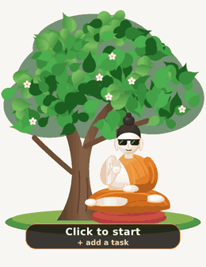
</p>

| 1. Duration | 2. Task | 3. Allowed Apps |
| :---: | :---: | :---: |
| 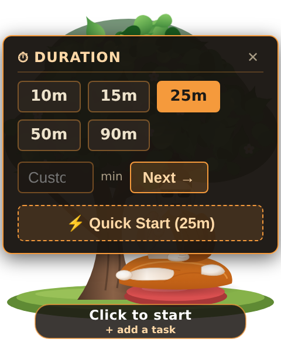 | 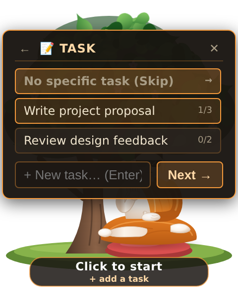 | 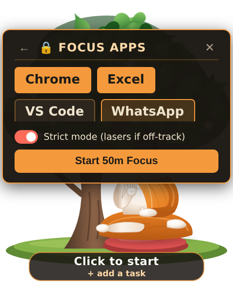 |

### Distraction Detection & Laser Nudges
*Drift to an unlisted app or distracting site, and Bodhi locks on with targeted lasers after a gentle grace period.*

<p align="center">
  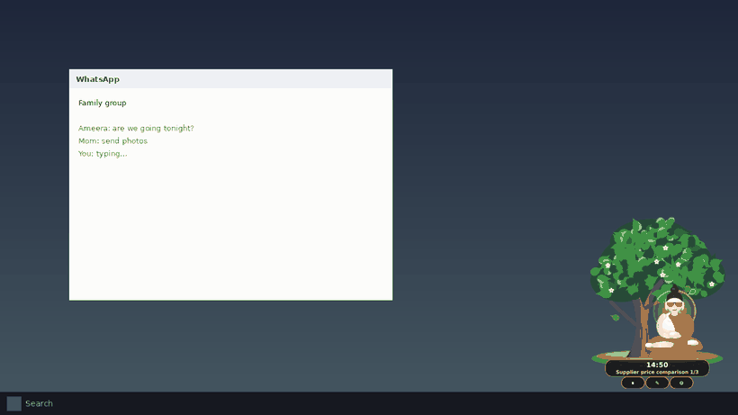
</p>

<p align="center">
  
</p>

### Breaks You Actually Take
*Guided box breathing and hydration reminders right on your screen.*

<p align="center">
  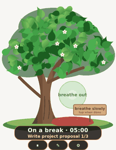
  &nbsp;&nbsp;&nbsp;&nbsp;
  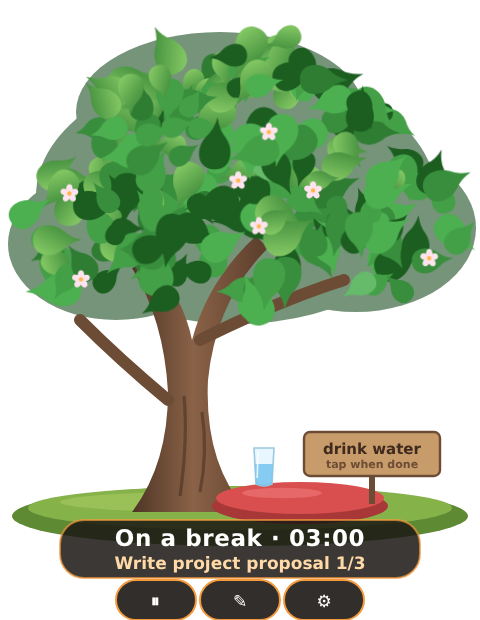
</p>

### Relaxed Idle Companionship
*When no timer is running, Bodhi reads the paper, listens to music with headphones, or relaxes.*

<p align="center">
  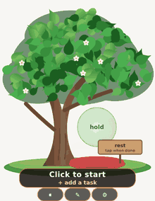
</p>

### The Tree Grows With You
*Every completed session nurtures the Bodhi tree from a tiny sapling to a sprawling ancient canopy.*

<p align="center">
  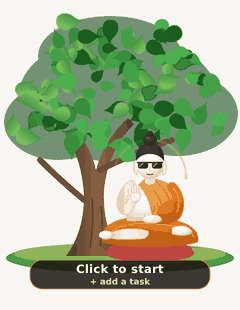
  <br>
  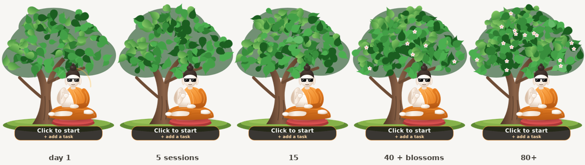
</p>

### Meaningful Daily Reports
*Automatic end-of-day summary with total focus time, timeline breakdown, tasks completed, and distractions logged.*

<p align="center">
  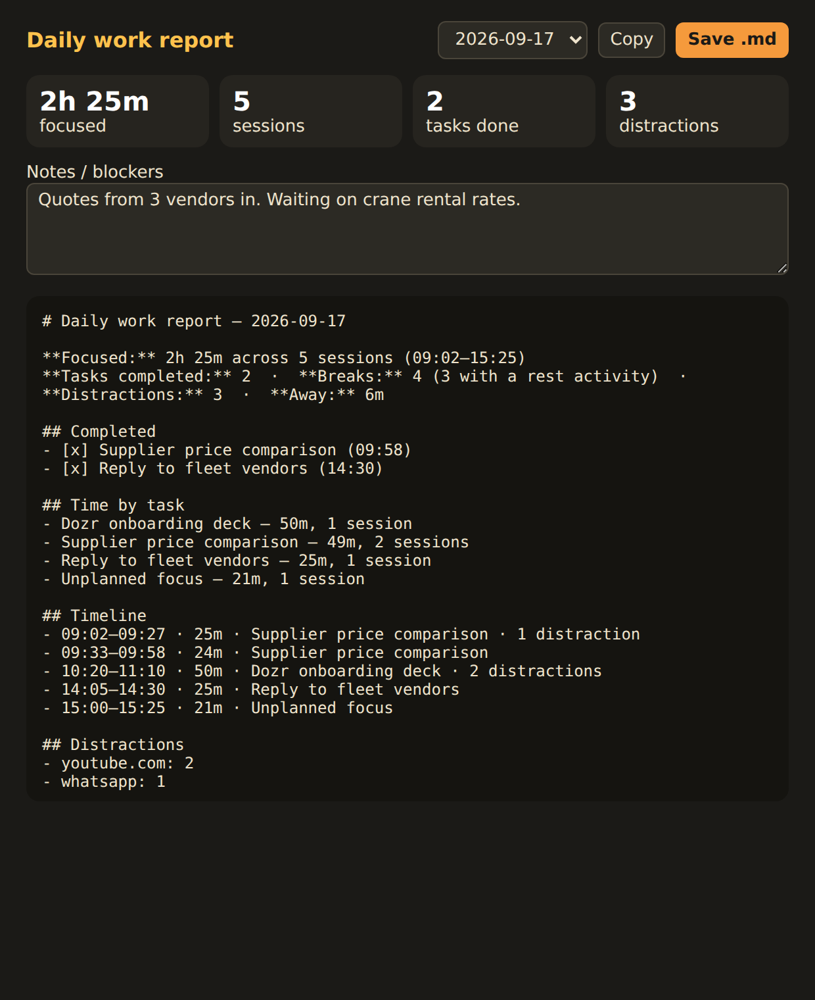
</p>

---

## ✨ Features

- 🧘 **Ambient Desktop Companion:** Floating, transparent character that meditates with you without interrupting your workflow.
- 🎯 **Inline Fast Setup:** Quick 3-tap inline wizard on the pet to launch sessions instantly.
- ⚡ **Laser Distraction Guards:** Automatically flags distracting websites and processes, offering a customizable grace period before firing laser beams.
- 🌳 **Progression System:** Your Bodhi tree advances across 5 evolutionary stages based on lifetime completed sessions.
- 📊 **Markdown Daily Reports:** Clean end-of-day summary tracking focus distribution, completed tasks, and distracted intervals.
- ⚙️ **Minimal Settings:** Simple primary configuration (focus duration, break duration, pet size, sound toggle, laser toggle) with expandable advanced options.
- 🖥️ **Multi-Monitor Aware:** Freely drag Bodhi across any display; scales smoothly to your display resolution.
- 💤 **Auto-Away Pause:** Automatically pauses your timer when you leave your desk for coffee or lunch.

---

## 🛠️ Architecture & Tech Stack

Bodhi is designed to stay **featherweight and whisper-quiet**:

- **Vanilla JS + Electron:** Zero heavy frontend frameworks (no React or Vue bundles), ensuring instant startup and low memory footprint.
- **Native C# Window Watcher:** Tracks active foreground windows with ~0% CPU usage using an ultra-compact native binary (with PowerShell fallback).
- **Atomic File Storage:** All task lists, settings, and session state are written atomically with automatic backups to prevent data corruption.
- **Dynamic Procedural Graphics:** The pet, tree, and props are generated dynamically in code without heavy raster GIF assets, scaling crisply to any screen resolution or DPI.

---

## 🚀 Getting Started

### Prerequisites
- [Node.js](https://nodejs.org/) (>= 20.11.0)
- npm

### Installation & Run

```bash
# 1. Clone the repository
git clone https://github.com/afsalali1238/BodhiPomodoro.git

# 2. Open the prototype directory
cd BodhiPomodoro/prototype

# 3. Install dependencies
npm install

# 4. Launch Bodhi!
npm start
```

### Packaging / Build

To package a standalone Windows executable:

```bash
cd prototype
npm run dist:win
```

---

## 🧪 Testing & Quality

Bodhi has a 100% passing test suite and automated CI verification on both Ubuntu and Windows:

```bash
cd prototype
npm test        # unit test suite (state machine, distraction rules, storage, reports)
npm run lint    # ESLint code style and quality check
```

---

## ⌨️ Global Shortcuts

Control Bodhi seamlessly from anywhere in Windows:

| Shortcut | Action |
| :--- | :--- |
| `Ctrl + Alt + P` | Start / Pause / Resume timer |
| `Ctrl + Alt + S` | Skip current phase (Finish focus early / Skip break) |
| `Ctrl + Alt + T` | Open Task Manager |
| `Ctrl + Alt + R` | Open Daily Productivity Report |

---

<div align="center">
  <i>Stay focused. Protect your time. Grow the tree.</i> 🌳
</div>
